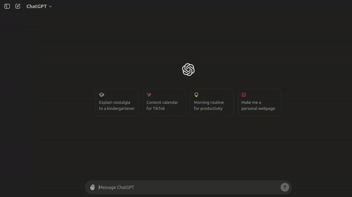
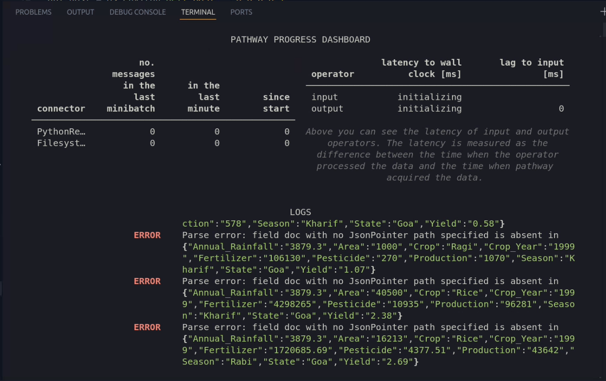
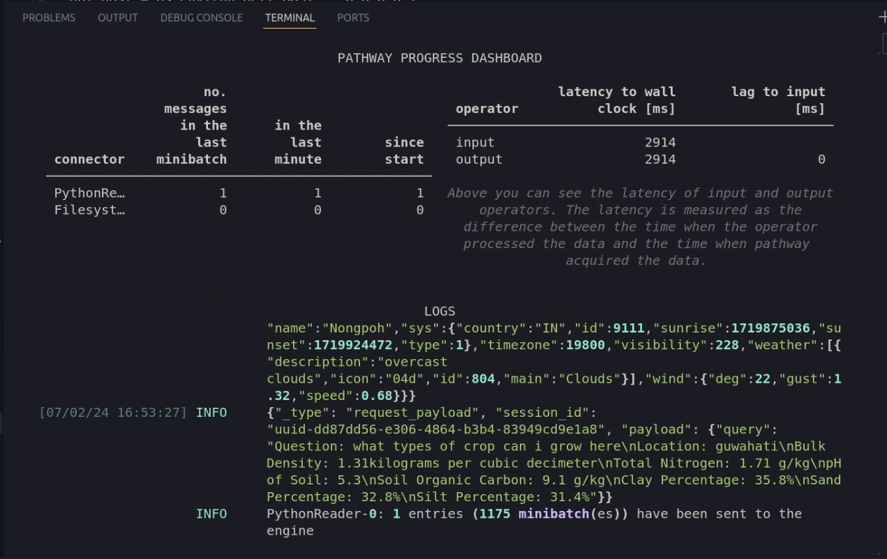

# Krishi Sahayak

Kishan Sahayak is an innovative AI app designed to empower the farmers by providing insightful answers to their day to day questions about improving their agricultural practices and protecting their crops. Leveraging JSON lines of data on soil, fertilizers, and crops, and integrating real-time weather and soil data through APIs, the app offers tailored and precise advice to enhance productivity and sustainability.

This app uses various jsonl data on different soil, temperature, yeild, crop, fertilizer, nutrient which has been took from Kaggle dataset.

## Features

- Real-time Weather and Soil Data: Integrates live data through APIs to provide current and location-specific recommendations.
- AI-Driven Insights: Uses Pathway, Hugging-Face Model and LiteLLM to build a real-time LLM-enabled data pipeline in Python, supporting live streaming, and user centric responses from generative AI Models without the need of fine-tuning model and saving money.
- Data and code reusability for offline evaluation. User has the option to choose to use local (cached) or real data.
- Open-Source Model: uses model from Hugging-Face ensuring user have variety vendor to pick from.
- Diverse Agricultural Data: Utilizes various JSON lines of data on different soil types, temperature, yield, crops, fertilizers, and nutrients sourced from Kaggle datasets and also from various API so that user can have answer meant for them.
- High-Quality Input through APIs: Allows for the integration of high-quality and various types of input data through APIs, enhancing the app's flexibility and accuracy and tailored to user need.

## Further Improvements

There are many things and features that can be integrated with this such as:

- Incorporate image based soil recognizition using satellite imagery from open weather api with POLYGON ID and classified dataset in kaggle
- Make it more user-friendly by using MERN stack.
- Integrating more Data Sources in the pipeline with help of Pathway.
- Maintain a data snapshot to observe variations in soils-quality and yeild over time, as Pathway provides a built-in feature to compute **differences** between two alterations.
- We can also use web-scrapper to feed data on fertilizer in market and fetch their price and availabilty.
- Beyond making data accessible via API or UI, the LLM App allows you to relay processed data to other downstream connectors, such as BI and analytics tools. For instance, set it up to **receive alerts** upon detecting price shifts.
- Make it more fast and safe from server failure because of loading of model.
- Because of **rounding off of coordinate**, not good at handling request for coastal places such as mumbai.
- It need to be Dockerized so that user in WINDOWS can also use it.

## Demo

As we are using location based weather and soil api it could deliver tailored results to users:
Here is the of How to run it:


**NOTE** - for better visibility you can download or preview whole workflow from [here](./assets/whole_workflow.mp4)

As evident, ChatGPT interface offers general advice on agriculture but lacks specificity regarding the current location of the user and the soil type of that area, among other details:




## How the project works

The sample project does the following procedures to achieve the above output:

1. Prepare search data:
    1. Dataset: It contains dataset on the crop, soil, yeild, fertilizer dataset fetched from **Kaggle**. you can see it [here](./examples/data/)
    2. Fetch the soil and weather data based on user request: [utility_function.py](./examples/ui/utility_function.py) fetch data from api clean it and make it ready to be sent with prompt in a concise manner.
    3. Chunk: Documents are shortened, mostly self-contained sections to be embedded. user can choose thier embedding model by just changing the name of embedder_locator in [genai_helper](./common/genai_helper.py) and in .env file
    4. Embed: Each section is [embedded](https://docs.litellm.ai/docs/embedding/supported_embedding) with the help of **LiteLLM and Hugging Face Model** and retrieve the embedded result.
    5. Indexing: Constructs an index on the generated embeddings.
2. Search (once per query)
    1. Given a user question, do a proper prompting and give clean data fetched from **OpenCagedData** for approx lat and lon of that place, **Soilgrids by isric.org** for details about the soil at that coordinate, **openweathermap.org** for weather of that region, generate an embedding for the query from the Open source AI model API by [Hugging-Face](https://huggingface.co/).
    2. Using the embeddings, retrieve the vector index by relevance to the query
3. Ask (once per query)
    1. Insert the location and question to ask.
    2. Similarly you can change your model by just changing the name of model_locator in [genai_helper](./common/genai_helper.py) and in .env file.
    2. Return AI model's answer

## How to run the project

Example only supports Unix-like systems (such as Linux, macOS, BSD).

### Prerequisites

1. Make sure that [Python](https://www.python.org/downloads/) 3.10 or above installed on your machine.
2. Download and Install [Pip](https://pip.pypa.io/en/stable/installation/) to manage project packages.
3. Create an [Hugging-Face](https://huggingface.co/) account and generate a new API Key: To access the Open source AI API, you will need to create an API Key.
4. Create API key for **openweathermap.org** and **OpenCagedData**. **Soilgrids by isric.org** does not need an API key.

Then, follow the easy steps to install and get started using the sample app.

### Step 1: Clone the repository

This is done with the `git clone` command followed by the URL of the repository:

```bash
git clone https://github.com/Jitmandal051004/Sahayak_LLMApp
```

Next,  navigate to the project folder:

```bash
cd Sahayak_LLMApp
```

### Step 2: Set environment variables

Create `.env` file in the root directory of the project, copy and paste the below config and give your API keys 

```bash
HOST=0.0.0.0
PORT=8080
EMBEDDER_LOCATOR=huggingface/microsoft/codebert-base
EMBEDDING_DIMENSION=768
MODEL_LOCATOR=huggingface/codellama/CodeLlama-34b-Instruct-hf
MAX_TOKENS=1000
TEMPERATURE=0.0

HuggingFace_API_KEY={HuggingFace_API_KEY}
GEOCODE_API_KEY={GEOCODE_API_KEY}
WEATHER_API_KEY={WEATHER_API_KEY}
```

### Step 3: Install the app dependencies

Install the required packages:

```bash
pip install --upgrade -r requirements.txt
```
### Step 4 (Optional): Create a new virtual environment

Create a new virtual environment in the same folder and activate that environment:

```bash
python -m venv pw-env && source pw-env/bin/activate
```

### Step 5: Run and start to use it

You start the application by navigating to `llm_app` folder and running `main.py`:

```bash
python main.py
```

When the application runs successfully, you should see output something like this:

**Before Streamlit starts:**


### Step 6: Run Streamlit UI for file upload

You can run the UI separately by navigating to `cd examples/ui` and running Streamlit app
`streamlit run app.py` command. It connects to the Discounts backend API automatically and you will see the UI frontend is running http://localhost:8501/ on a browser:


**After Streamlit Starts:**


### Test the sample app

Open the web Browser and paste the URL http://localhost:8501/, put location and put your query.

**NOTE** - In case the app shows Connection Lost error after entering question because of Model loading just restart the server by again running 

## Credits :

### Resources :
- [HuggingFace_Documentation](https://huggingface.co/docs)
- [LiteLLM_Doc](https://docs.litellm.ai/docs/)
- [Pathway_Doc](https://pathway.com/developers/user-guide/introduction/welcome)
- [OpenCagedData](https://opencagedata.com/api#quickstart)
- [Soilgrids by isric.org](https://rest.isric.org/soilgrids/v2.0/docs#/default/query_layer_properties_properties_query_get)
- [openweathermap.org](https://openweathermap.org/api)

### Special Thanks :
- [Pathway and DEVSOC](https://devsoc-bits-goa.gitbook.io/rag-and-llm-bootcamp) - for having this workshop, learnt a lot from this documentation and opened a lot of venue for me.
- [Boburmizo- ChatGPT API Python sales app](https://github.com/Boburmirzo/chatgpt-api-python-sales) - helped me a lot in building the pipeline for my model.
- [AeroIntel by Alphawarrior21](https://github.com/Alphawarrior21/AeroIntel) - It helped me a lot in the process of Ideation for my project.
